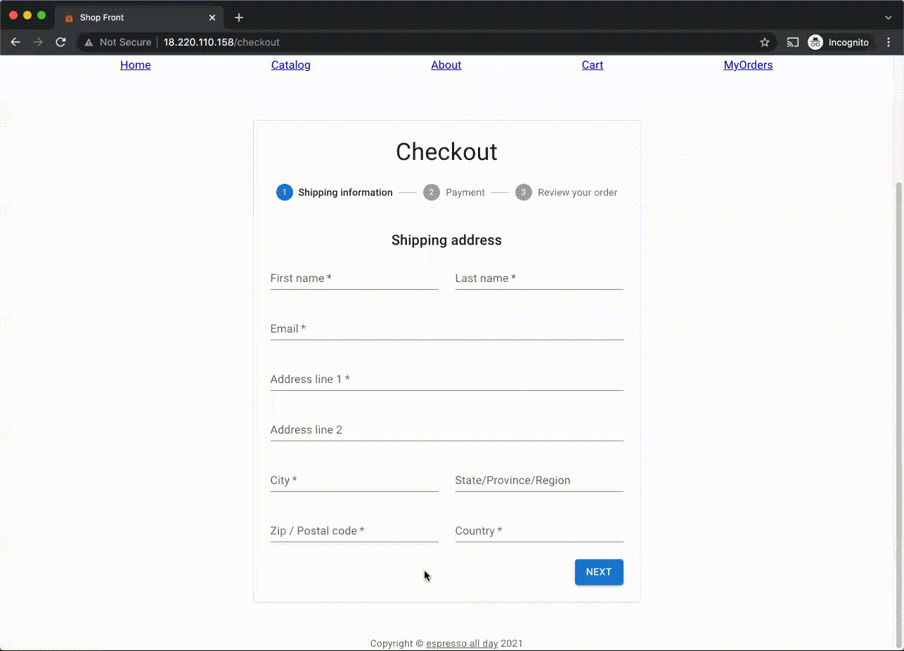
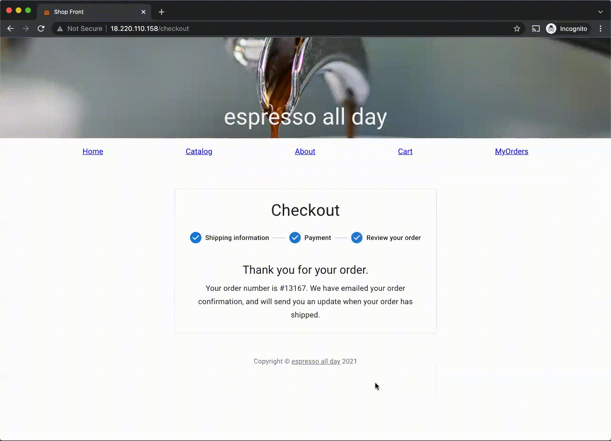

# shopfront


<p
  align="center">
  
</p>

<p
  align="center">
  
</p>

<p
  align="center">
  
</p>

An E-commerce web application to purchase items, powered by Shopify

<!-- ## Deployed Link

Hosted on AWS: [shop front](http://18.220.110.158/) -->

## JS Library/Framework

The front-end framework for this project is React.js.

The project is written with React functional components for more flexible development.

## User Interactions

- The user is able to browse a list of products from a Shopify development store.

- The user is able to use the search bar on the home page to find products.

- The user is able to add the product to cart and update product quantity in cart.

- Cart content is stored in the browser, so the user is able to see items stored in the cart from a previous session.

- The user is able to fill out an address form and payment information to complete the checkout process.

- The user is able to search for orders with the email address used at the time of checkout.

- After obtaining a list of orders, the user is able to update and delete each order.

## Backend service

- An Express server written in Node.js powers the interactions between the client and database. The server is also responsible for retrieving product data from the Shopify REST Admin API and sending the data to the client.

- MongoDB is used as the database to store order information.

- Each order contains the user's shipping information and purchase details regarding item name and quantity. No payment information is currently stored.

## Overall Architecture

- The app is built with an MVC structure.

- The root directory contains configuration files for the Express server. `src` contains the server file and initiates the MongoDB connection.

- `src/models` contains the MongoDB schema and interface for each order.

- `src/controllers` contains server handler functions for each endpoint (create an order, get orders for an email, update one order, delete one order). In addition, `src/controllers/shopify.ts` makes the API call to Shopify REST Admin API.

- `client/src` contains all React components. `client/src/routes` includes all route components accessible in the app.

- `client/src/controller` contains a controller component that handles the API call to retrieve product data from the Express server. The app is optimized to make only 1 API call. All components that display product information use the returned results.

## Third Party RESTful API

Shopify REST Admin API

## UI library

MUI (formerly Material-UI)

## Reusable component

The Product component is a card that contains product information. It is shared across the catalog listing and cart content, each with additional elements to render relevant content.

The Address Form component is shared across the checkout process and edit order functionality.

## Installation

npm is the package management system for this project.

1. Install dependencies

   ```sh
   npm install
   cd client
   npm install
   ```

2. Create a `.env` file in the root directory

   ```js
   # Set to production when deploying to production
   NODE_ENV=development

   # Node.js server configuration
   SERVER_PORT=YOUR_PREFERRED_PORT

   # Shopify API Variables
   username=YOUR_SHOPIFY_API_KEY
   password=YOUR_SHOPIFY_PASSWORD
   shop=YOUR_SHOPIFY_SHOP
   apiversion=2021-10
   resource=products

   # MongoDB Cloud Atlas
   MONGODB_URI=mongodb+srv://<YOUR_USERNAME>:<YOUR_PASSWORD>@<YOUR_CLUSTER>.ytgwd.mongodb.net/<YOUR_DATABASE>?retryWrites=true&w=majority
   ```

3. Run production client

   ```sh
   cd client
   npm run build
   ```

4. Run the production server

   ```sh
   npm run prestart
   npm run start
   ```

5. To use the application in development mode

   ```sh
   npm run dev
   cd client
   npm run start
   ```

   In `client/src/.env`, set `NODE_ENV` to `development`.
